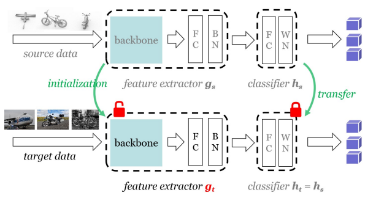

# TTA_Readers
This is a repository for organizing papers related to domain adaptation.

# 1 Test-time Adaptation
-------------------------------------------------------------------------
## 1.1. 2020 ["Do We Really Need to Access the Source Data? Source Hypothesis Transfer for Unsupervised Domain Adaptation"] (https://arxiv.org/pdf/2002.08546) Code: https://github.com/tim-learn/SHOT

### 1.1.1 Overview 

### 1.1.2 Methods
在这里，SHOT主要使用了三种LOSS来进行模型的训练，具体的使用熵最小化loss来促使数据具有显著的类差异，多样性熵loss促使样本在整体上具有多样性，这两种loss构成了SHOT-IM方法。

为了进一步利用数据信息，使用一种聚类的方法来得到样本的伪标签，并加入模型的训练中，这三种loss构成了SHOT。

-------------------------------------------------------------------------
## 1.2. ["Tent: Fully Test-time Adaptation by Entropy Minimization"] (https://arxiv.org/pdf/2006.10726) Code: https://github.com/DequanWang/tent

### 1.2.1 Overview 

### 1.2.2 Methods
Tent通过测试熵最小化进行调整。特别的，该方法仅使用每个批次数据进行在线更新正则化BatchNorm的参数。

-------------------------------------------------------------------------
## 1.3. ["Test-Time Classifier Adjustment Module for Model-Agnostic Domain Generalization"] (https://proceedings.neurips.cc/paper_files/paper/2021/file/1415fe9fea0fa1e45dddcff5682239a0-Paper.pdf) Code: https://github.com/matsuolab/T3A

### 1.3.1 Overview 

### 1.3.2 Methods
T3A使用以下过程调整训练后的线性分类器（深度神经网络的最后一层）：（1）使用由源域中训练的基础分类器增强的在线未标记数据为每个类计算伪原型表示，（2）然后根据每个样本与伪原型的距离对其进行分类。T3A无需反向传播，仅修改线性层；因此，推理过程中计算成本的增加可以忽略不计，并避免了随机优化可能导致的灾难性故障。

-------------------------------------------------------------------------
## 1.4. 2022 ["Continual Test-Time Domain Adaptation"] (https://arxiv.org/pdf/2203.13591) Code: https://github.com/qinenergy/cotta

### 1.4.1 Overview 

### 1.4.2 Methods
现有的方法大多基于自我训练和熵正则化，可能会受到这些非平稳环境的影响。由于目标域中的分布随时间而变化，伪标签变得不可靠。嘈杂的伪标签会进一步导致错误积累和灾难性遗忘。为了解决这些问题，我们提出了一种持续测试时间自适应方法（CoTTA），它包含两部分。首先，我们建议通过使用通常更准确的加权平均和增强平均预测来减少错误积累。另一方面，为了避免灾难性遗忘，我们建议在每次迭代中随机恢复一小部分神经元到源预训练权重，以帮助长期保存源知识。所提出的方法可以实现网络中的所有参数的长期适应。

