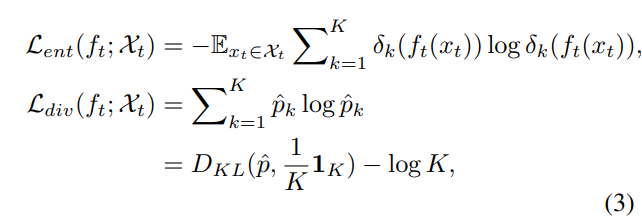
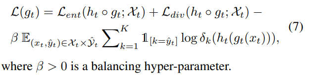

# TTA_Readers
This is a repository for organizing papers related to domain adaptation.

# 1 Test-time Adaptation
## 1.1. ["Do We Really Need to Access the Source Data? Source Hypothesis Transfer for Unsupervised Domain Adaptation"] ([https://arxiv.org/pdf/1706.03762.pdf](https://proceedings.mlr.press/v119/liang20a/liang20a.pdf)) [https://github.com/tim-learn/SHOT]

### 1.1.1 Overview 

### 1.1.2 Methods
在这里，SHOT主要使用了三种LOSS来进行模型的训练，具体的使用熵最小化loss来促使数据具有显著的类差异，多样性熵loss促使样本在整体上具有多样性，这两种loss构成了SHOT-IM方法。

为了进一步利用数据信息，使用一种聚类的方法来得到样本的伪标签，并加入模型的训练中，这三种loss构成了SHOT。

## 1.2. ["Tent: Fully Test-time Adaptation by Entropy Minimization"] ([https://arxiv.org/pdf/2006.10726]) [https://github.com/tim-learn/SHOT]

### 1.2.1 Overview 

### 1.2.2 Methods
在这里，SHOT主要使用了三种LOSS来进行模型的训练，具体的使用熵最小化loss来促使数据具有显著的类差异，多样性熵loss促使样本在整体上具有多样性，这两种loss构成了SHOT-IM方法。

为了进一步利用数据信息，使用一种聚类的方法来得到样本的伪标签，并加入模型的训练中，这三种loss构成了SHOT。

