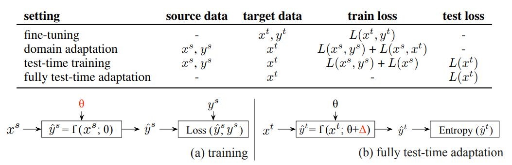

# TTA_Readers
This is a repository for organizing papers related to domain adaptation.

# 目录

- [Test Time Adapataion]
    - [1. 2020 ICML: SHOT-IM, SHOT](#1.1.1-Overview)

    - [2. 2021 ICLR: Tent](#1.2.1-Overview)

    - [3. 2021 NeurIPS: T3A](#1.3.1-Overview)

    - [4. 2022 CVPR: Cotta](#1.4.1-Overview)

    - [5. 2022 ICML: EATA](#1.5.1-Overview)

    - [6. 2023 ICLR: SAR](#1.6.1-Overview)
   
    - [7. 2023 CVPR: TSD](#1.7.1-Overview)

    - [8. 2023 CVPR: ROTTA](#1.8.1-Overview)

    - [9. 2023 ICCV: DomainAdaptor](#1.9.1-Overview)

    - [10. 2024 ICLR: DeYO](#1.10.1-Overview)

    - [11. 2024 ICLR: ATTA](#1.11.1-Overview)

    

# 1 Test-time Adaptation
-------------------------------------------------------------------------
## 1.1. 2020 ["Do We Really Need to Access the Source Data? Source Hypothesis Transfer for Unsupervised Domain Adaptation"] (https://arxiv.org/pdf/2002.08546) Code: https://github.com/tim-learn/SHOT

### 1.1.1 Overview 

### 1.1.2 Methods
在这里，SHOT主要使用了三种LOSS来进行模型的训练，具体的使用熵最小化loss来促使数据具有显著的类差异，多样性熵loss促使样本在整体上具有多样性，这两种loss构成了SHOT-IM方法。

为了进一步利用数据信息，使用一种聚类的方法来得到样本的伪标签，并加入模型的训练中，这三种loss构成了SHOT。

-------------------------------------------------------------------------
## 1.2. 2021 ICLR ["Tent: Fully Test-time Adaptation by Entropy Minimization"] (https://arxiv.org/pdf/2006.10726) Code: https://github.com/DequanWang/tent
### 1.2.1 Overview 

### 1.2.2 Methods
Tent通过测试熵最小化进行调整。特别的，该方法仅使用每个批次数据进行在线更新正则化BatchNorm的参数。

-------------------------------------------------------------------------
## 1.3. 2021 NeurIPS ["Test-Time Classifier Adjustment Module for Model-Agnostic Domain Generalization"] (https://proceedings.neurips.cc/paper_files/paper/2021/file/1415fe9fea0fa1e45dddcff5682239a0-Paper.pdf) Code: https://github.com/matsuolab/T3A

### 1.3.1 Overview 

### 1.3.2 Methods
T3A使用以下过程调整训练后的线性分类器（深度神经网络的最后一层）：（1）使用由源域中训练的基础分类器增强的在线未标记数据为每个类计算伪原型表示，（2）然后根据每个样本与伪原型的距离对其进行分类。T3A无需反向传播，仅修改线性层；因此，推理过程中计算成本的增加可以忽略不计，并避免了随机优化可能导致的灾难性故障。

-------------------------------------------------------------------------
## 1.4. 2022 CVPR ["Continual Test-Time Domain Adaptation"] (https://arxiv.org/pdf/2203.13591) Code: https://github.com/qinenergy/cotta

### 1.4.1 Overview 

### 1.4.2 Methods
现有的方法大多基于自我训练和熵正则化，可能会受到这些非平稳环境的影响。由于目标域中的分布随时间而变化，伪标签变得不可靠。嘈杂的伪标签会进一步导致错误积累和灾难性遗忘。为了解决这些问题，我们提出了一种持续测试时间自适应方法（CoTTA），它包含两部分。首先，我们建议通过使用通常更准确的加权平均和增强平均预测来减少错误积累。另一方面，为了避免灾难性遗忘，我们建议在每次迭代中随机恢复一小部分神经元到源预训练权重，以帮助长期保存源知识。所提出的方法可以实现网络中的所有参数的长期适应。

-------------------------------------------------------------------------
## 1.5. 2022 ICML ["Efficient Test-Time Model Adaptation without Forgetting"] (https://arxiv.org/pdf/2204.02610) Code: https://github.com/mr-eggplant/EATA
### 1.5.1 Overview 

### 1.5.2 Methods
现阶段仍然面临两个实际挑战：1）现有方法必须对每个测试样本进行反向计算，导致许多应用程序无法承受预测成本；2）虽然现有 TTA 解决方案可以显著提高分布外数据的测试性能，但它们在 TTA 之后对分布内数据的性能往往会严重下降（称为灾难性遗忘）。在本文中，我们指出并非所有测试样本对模型自适应的贡献都是相同的，高熵的测试样本可能会导致噪声梯度，从而破坏模型。受此启发，我们提出了一个主动样本选择标准来识别可靠和非冗余样本，并在此基础上更新模型以最小化测试时自适应的熵损失。此外，为了缓解遗忘问题，我们引入了一个Fisher正则化器来约束重要的模型参数免受剧烈变化的影响，其中Fisher重要性是根据生成的伪标签的测试样本估计的。

-------------------------------------------------------------------------
## 1.6. 2023 ICLR ["Towards Stable Test-Time Adaptation in Dynamic Wild World"] (https://arxiv.org/pdf/2302.12400) Code: https://github.com/mr-eggplant/SAR
### 1.6.1 Overview 

### 1.6.2 Methods
当测试数据存在以下情况时，TTA 可能无法提升甚至损害模型性能：1）混合分布偏移，2）批次大小较小，以及 3）在线不平衡标签分布偏移。在本文中，我们研究了不稳定的原因，发现批次规范层是阻碍 TTA 稳定性的一个关键因素。相反，TTA 可以在与批次无关的规范层（即组或层规范）下表现更稳定。然而，我们观察到采用组和层规范的 TTA 并非总是成功，仍然会遭遇许多失败案例。通过深入研究失败案例，我们发现某些具有大梯度的噪声测试样本可能会干扰模型自适应并导致平凡解崩溃，即为所有样本分配相同的类标签。为了解决上述崩溃问题，我们提出了一种清晰度感知且可靠的熵最小化方法，称为 SAR，以从两个方面进一步稳定 TTA：1) 去除具有大梯度的部分噪声样本，2) 鼓励模型权重达到平坦最小值，以便模型对剩余的噪声样本具有鲁棒性。有希望的结果表明，SAR 比以前的方法表现更稳定，并且在上述野外测试场景下具有计算效率。

-------------------------------------------------------------------------
## 1.7. 2023 CVPR ["Feature Alignment and Uniformity for Test Time Adaptation"] ([https://arxiv.org/pdf/2302.12400](https://openaccess.thecvf.com/content/CVPR2023/papers/Wang_Feature_Alignment_and_Uniformity_for_Test_Time_Adaptation_CVPR_2023_paper.pdf)) Code: https://github.com/SakurajimaMaiii/TSD
### 1.7.1 Overview 

### 1.7.2 Methods
将TTA作为特征修订问题来解决，因为源域和目标域之间存在域差距。之后，我们按照对齐和均匀性这两个测量来讨论测试时特征修订。对于测试时特征均匀性，我们提出了一种测试时自蒸馏策略来保证当前批次和所有先前批次的表示之间的均匀性一致性。对于测试时特征对齐，我们提出了一种记忆空间局部聚类策略来对齐即将到来的批次的邻域样本之间的表示。为了处理常见的噪声标签问题，我们提出了熵和一致性过滤器来选择和删除可能的噪声标签。

-------------------------------------------------------------------------
## 1.8. 2023 CVPR ["Robust Test-Time Adaptation in Dynamic Scenarios"] (https://openaccess.thecvf.com/content/CVPR2023/papers/Yuan_Robust_Test-Time_Adaptation_in_Dynamic_Scenarios_CVPR_2023_paper.pdf) Code: https://github.com/BIT-DA/RoTTA
### 1.7.1 Overview 

### 1.8.2 Methods
提出了一个强大的批量标准化方案来估计标准化统计数据。利用内存库对类别平衡数据进行采样，同时考虑时效性和不确定性。此外，为了稳定训练过程，我们开发了一种具有师生模型的时间感知重新加权策略。大量实验证明，RoTTA 能够对相关采样的数据流进行持续的测试时间调整。

-------------------------------------------------------------------------
## 1.9. 2023 ICCV ["DomainAdaptor: A Novel Approach to Test-time Adaptation"] (https://arxiv.org/pdf/2308.10297) Code: https://github.com/koncle/DomainAdaptor
### 1.9.1 Overview 

### 1.9.2 Methods
AdaMixBN 通过在规范化层中通过动态混合系数和统计变换操作自适应地融合训练和测试统计来解决域偏移问题。为了进一步增强 AdaMixBN 的适应能力，设计了一个 GEMloss，它扩展了熵最小化损失，以更好地利用测试数据中的信息。

-------------------------------------------------------------------------
## 1.10. 2024 ICLR ["Entropy is not Enough for Test-Time Adaptation: From the Perspective of Disentangled Factors"] (https://openreview.net/pdf?id=9w3iw8wDuE) Code: https://whitesnowdrop.github.io/DeYO/
### 1.10.1 Overview 

### 1.10.2 Methods
观察到在有偏差的场景下，熵作为 TTA 置信度指标的不可靠性，并从理论上揭示了这源于忽视了数据的潜在解缠因子对预测的影响。基于这些发现，我们引入了一种名为“摧毁你的对象”（DeYO）的新型 TTA 方法，该方法利用了新提出的置信度指标“伪标签概率差异”（PLPD）。PLPD 通过测量应用对象破坏性变换前后预测之间的差异来量化对象形状对预测的影响。 DeYO 包括样本选择和样本加权，它们同时使用熵和 PLPD。为了实现稳健的适应性，DeYO 在进行预测时优先考虑主要包含形状信息的样本。

-------------------------------------------------------------------------
## 1.12. 2024 ICLR ["Active Test-Time Adaptation: Theoretical Analyses and An Algorithm"] (https://openreview.net/pdf?id=YHUGlwTzFB) Code: https://github.com/divelab/ATTA
### 1.11.1 Overview 

### 1.12.2 Methods
提出了主动测试时自适应 (ATTA) 的新问题设置，将主动学习集成到完全 TTA 设置中。我们提供了学习理论分析，证明结合有限的标记测试实例可以在理论上保证跨测试域的整体性能。我们还提出了一种样本熵平衡方法，用于实现 ATTA，同时避免灾难性遗忘 (CF)。我们引入了一种简单而有效的 ATTA 算法，称为 SimATTA，使用实时样本选择技术。

